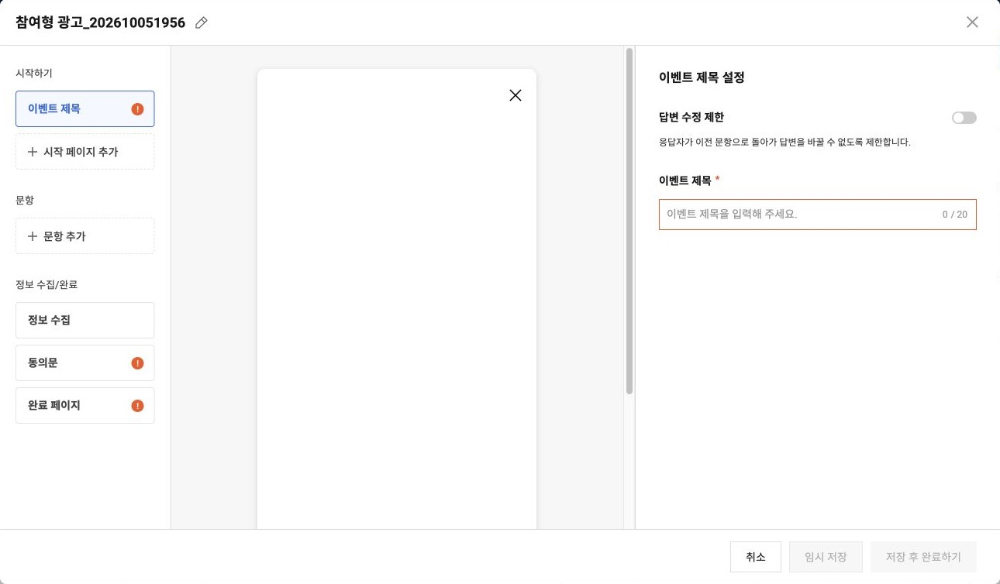
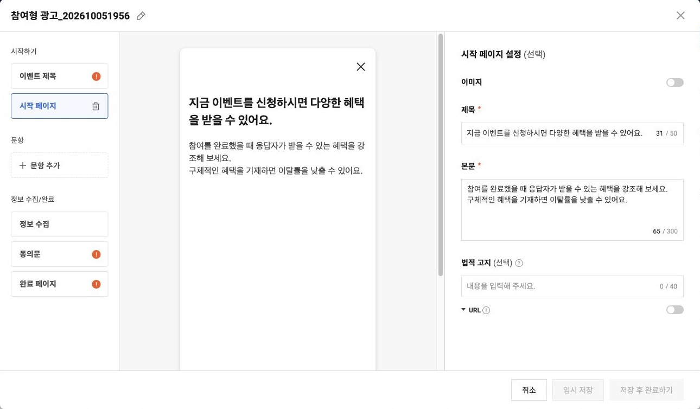
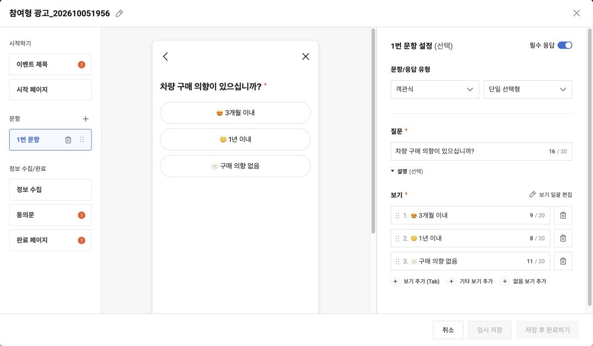
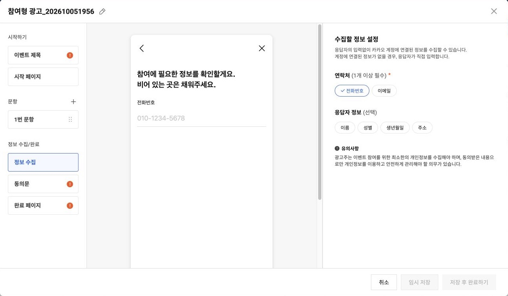
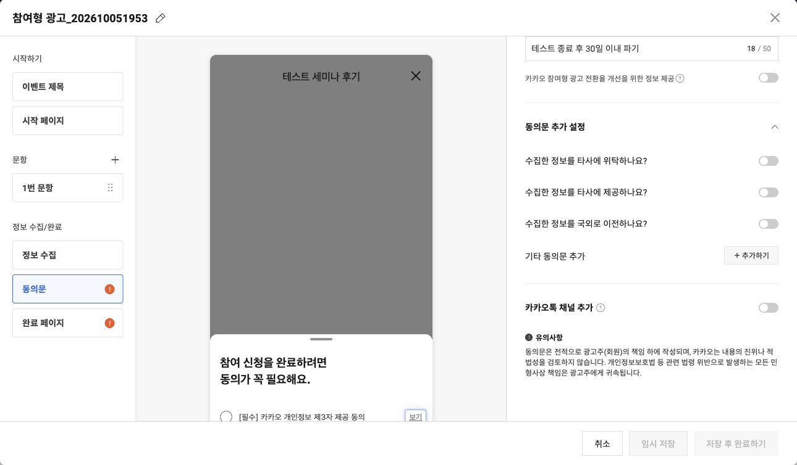
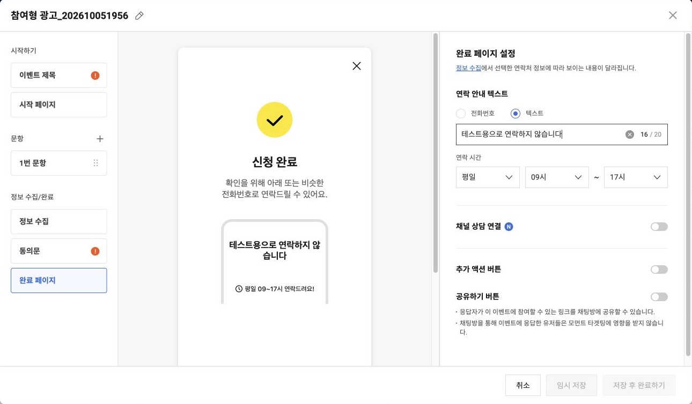

# 비즈니스폼+ 만들기 — Codex 전용 비공식 스킬

**카카오모먼트 비즈니스폼+의 2026년 10월 5일 기준 기능과 관리자 화면을 바탕으로 만든 Codex 전용 스킬입니다.** 세미나 후기, 상담 신청, 이벤트 참여 설문 등을 기획하고, Codex의 Computer Use로 Chrome에서 제작·저장·관리하는 데 필요한 절차를 담았습니다.

> **비공식 스킬입니다.** 카카오 또는 OpenAI가 제작·배포·인증한 공식 스킬이 아니며, 두 회사의 지원이나 기능 보장을 의미하지 않습니다. 카카오 공식 문서와 실제 관리자 화면을 참고해 개인이 작성한 작업 지침입니다.
>
> **기능 기준일은 2026년 10월 5일입니다.** 이후 카카오모먼트 UI·입력 제한·정책·API가 바뀌면 현재 화면과 최신 공식 문서를 확인해야 합니다. 모든 기능을 실제 운영 환경에서 실행 검증한 것은 아닙니다.

작업 지침은 **2026년 10월 6일 실사용 피드백**을 반영해 업데이트했습니다. 카카오 기능·화면의 기준일과 아래 캡처 날짜는 2026년 10월 5일로 유지합니다. 변경 내역은 [CHANGELOG.md](CHANGELOG.md)에서 확인할 수 있습니다.

## 어떤 스킬인가요?

사용자가 매번 가이드 링크와 작업 절차를 다시 전달하지 않아도, 설치된 스킬이 비즈니스폼+ 제작·관리 요청에 필요한 참고자료를 읽고 작업하도록 구성했습니다. 스킬은 프로그램을 독립적으로 실행하는 앱이 아니라 Codex가 읽는 `SKILL.md`, 기능별 참고자료, 표시 설정 파일의 묶음입니다.

표시 이름은 **비즈니스폼+ 만들기**, 호출 이름은 **`$kakao-bizformplus`**입니다. 명시적으로 호출할 수 있고, 관련 요청에 자동 선택될 수 있도록 설정했습니다. 자동 선택 여부는 실행하는 Codex 환경에 따라 달라질 수 있습니다.

이 배포물은 **Codex 전용으로 설계·검증했습니다.** ChatGPT 일반 대화용 GPT, 카카오 플러그인, Chrome 확장 프로그램 또는 자체 실행 웹앱이 아닙니다. Chrome 제어에는 별도로 사용할 수 있는 Codex Computer Use 환경이 필요합니다. 다른 AI 제품과의 호환성을 보장하지 않습니다.

## 제작 기능

|영역|스킬에 담긴 기능|
|---|---|
|기획|목적·참여 대상·테스트/실운영 구분, 행사·수집 정보·보유 기간·저장 상태 정리|
|제목·시작 페이지|관리용 이름과 이벤트 제목 구분, 시작 페이지 추가, 이미지·제목·본문·법적고지 링크|
|객관식|단일 선택형·복수 선택형, 보기 작성·일괄 편집·순서 변경, 기타·없음 보기|
|주관식|단답형·서술형·숫자형·날짜형, 유형에 맞는 질문·범위·단위 설정|
|계층형|상위 선택에 따른 하위 보기 구성, 단계 설계, 최신 엑셀 샘플 활용 절차|
|문항 공통|필수 응답·설명·문항 순서·삭제·설문 요약·미리보기 점검|
|답변 수정 제한|이전 문항으로 돌아가 답변을 바꾸는 것을 제한하는 옵션의 목적과 사용 판단|
|정보 수집|전화번호·이메일 및 이름·성별·생년월일·주소의 필요성 검토|
|기본 동의문|진행할 이벤트 확인, 이벤트에 맞는 동의문 초안, 수집·활용 주체·권한·목적·보유 기간 확인|
|동의문 확장|타사 위탁·제3자 제공·국외 이전, 기타 동의문의 필수/선택 구분|
|추가 동의 옵션|카카오톡 채널 추가, 전환율 개선을 위한 정보 제공 옵션의 도움말·목적 확인|
|완료 페이지|연락 안내·연락 시간, 채널 상담·안내 문구·연동 채널, 추가 액션 URL·공유 버튼|
|저장|임시 저장과 작성 완료 구분, 필수값 검증, 저장 결과·폼 ID·상태 확인|
|소재 연결|완료 폼을 소재에서 선택하는 절차와 폼 생성/광고 운영의 범위 구분|

입력 제한은 [제작 참고자료](kakao-bizformplus/references/creation.md)에 요약했습니다. 제한은 고정 코드로 강제하지 않으며 실제 화면에서 달라진 값을 확인해 적용하도록 지시합니다.

## 주요 제작 화면 — 2026년 10월 5일 캡처

아래는 Chrome에서 실제 비즈니스폼+ 편집기를 열어 촬영한 화면입니다. 플랫폼 기본 예시 문구와 설명용 테스트 문구를 사용한 **미저장 예시**이며, 실제 이벤트 운영·추첨·경품 지급 결과를 나타내지 않습니다. 촬영 후 이 초안은 저장하지 않고 닫았습니다.

공개 이미지에는 계정 이메일·광고계정 ID·사업자 정보가 보이지 않도록 편집기 영역만 캡처했습니다. 정보 수집 미리보기의 전화번호는 플랫폼이 표시한 예시 값으로 실제 참가자 정보가 아닙니다. 이 화면이 카카오의 모든 향후 UI를 대표하지는 않습니다.

### 1. 이벤트 제목과 답변 수정 제한

왼쪽에서 제작 단계를 선택하고 오른쪽에서 이벤트 제목과 이전 답변 수정 제한을 설정합니다. 중앙은 참여자 미리보기입니다.



### 2. 시작 페이지

행사 안내를 제목과 본문으로 작성합니다. 이미지 사용과 법적고지 URL은 목적과 업종에 맞게 설정합니다.



### 3. 설문 문항

객관식 단일 선택형 예시입니다. 필수 응답, 문항·응답 유형, 질문, 보기와 일괄 편집을 설정하고 미리보기를 확인합니다.



### 4. 정보 수집

연락처와 선택 수집 항목을 고르는 화면입니다. 설문 목적에 필요한 정보만 선택합니다.



### 5. 동의문 추가 설정

타사 위탁·제공·국외 이전, 기타 동의문, 채널 추가 옵션을 확인할 수 있습니다. 사업자 정보가 있는 상단 영역은 캡처에서 제외했습니다.



### 6. 완료 페이지

연락 안내와 시간, 채널 상담 연결, 추가 액션, 공유 기능을 설정합니다. 이 예시는 테스트 안내를 사용하고 채널 상담은 끈 상태입니다.



## 관리·연동 기능

|영역|스킬에 담긴 기능|
|---|---|
|폼 목록|이름·ID·상태·수정일로 대상 구분, 필터·정렬·페이지 활용, 연결 소재·응답 수 확인|
|권한|폼 관리자·보고서 다운로드·알림톡 수신 권한의 관계, 대상 멤버와 변경 범위 확인|
|알림톡|수신 요일·시작/종료 시간·주기, 수신 대상·신규 응답 유무·시간대 밖 응답 처리 점검|
|랜딩 URL|실제 관리 화면에서 URL 확인, 링크 공유와 광고 랜딩의 활용 구분|
|보고서|응답 결과·폼 광고 보고서의 차이, 다운로드 권한·파일 암호·암호화 ZIP 안내|
|변경 이력|현재 제공되는 이력 범위와 변경 내용·일시 확인|
|삭제|소재 연결·응답 존재 여부 확인, 복구 불가 삭제의 최종 확인 절차|
|API|공식 응답 조회 엔드포인트·인증·필요 권한·쿼리·커서 페이징·결과 필드·오류 대응|

API 자료는 **응답 결과 조회**를 다룹니다. 폼 생성·수정·삭제 API를 제공한다고 가정하지 않습니다. 보고서나 API 응답을 외부 CRM 등에 전송하는 작업은 목적지와 데이터 범위를 별도로 확인해야 합니다.

## 세미나 후기·추첨 참여 템플릿

이전 세미나 후기 제작 목적을 일반화한 예시를 포함했습니다. 기존 계정의 실제 폼 원문이나 응답 데이터를 복제한 예시는 아닙니다.

**세미나를 모든 이벤트의 기본값으로 쓰지 않습니다.** 실운영 폼은 사용자가 진행할 이벤트와 개인정보 사용 목적을 먼저 확인하고, 그 내용에 맞는 동의문 초안을 만듭니다. 이미 전달된 이벤트 내용은 다시 묻지 않습니다. 행사 내용 없이 순수 테스트용 폼만 요청한 경우에만 세미나 테스트 예시를 기본으로 사용합니다. 다른 테스트 이벤트를 지정하면 그 내용을 우선합니다.

이벤트별 수집 목적·수집 항목·주체·보유 및 처리 계획을 정리해 기본 동의문 설정에 반영하는 절차는 [동의문 초안 참고자료](kakao-bizformplus/references/consent-drafting.md)에 담았습니다. 경품 응모·참석 신청·상담 신청·후기 설문 예시를 제공하며, 미확정 기간이나 처리 업체를 대신 확정하지 않습니다.

- 만족도, 도움 된 내용, 후기, 개선점, 추첨 참여 의사로 구성하는 5문항 예시
- 실제 추첨·경품 지급을 하지 않는 테스트용 안내
- 연락처 수집 목적과 보유 기간 예시
- 실운영 전환 시 확정할 행사 일정·경품·당첨 인원·발표·지급 방법
- 상담 신청·참석 신청·상품 선택 목적에 맞게 문항을 바꾸는 방법

템플릿의 전화번호 수집과 ‘테스트 종료 후 30일 이내 파기’는 예시의 선택입니다. 모든 폼에 자동으로 적용하는 기본 정책이 아닙니다. 실제 목적과 운영 계획에 맞게 수정합니다. 개인정보 동의문에 기간을 입력하는 것만으로 다운로드 파일이나 연동 시스템의 자동 파기가 설정되지는 않습니다.

## 저장과 작업 범위

**임시 저장**은 수정 가능한 초안이며, **작성 완료**는 내용 수정이 불가능한 최종 상태로 구분합니다. 스킬은 요청한 저장 상태를 확인하고, 클릭했다는 사실만으로 저장에 성공했다고 보고하지 않도록 구성했습니다.

‘저장하지 말 것’이라는 요청은 임시 저장도 하지 않는다는 뜻으로 처리합니다. ‘최종 저장만 하지 말 것’은 임시 저장 허용 여부를 요청 맥락에서 구분합니다. 미저장 검토 요청은 입력한 탭을 유지하고, 임시 저장·작성 완료를 각각 실행했는지 명시합니다. 초안 검토 중 편집기를 닫거나 재로드해 입력 내용을 버리지 않도록 안내합니다.

광고주 권한 보유·위임은 사용자에게 확인된 사실에 근거합니다. 로그인 상태나 마스터 표시만으로 위임을 추정하지 않습니다. 권한 확인 체크박스나 비활성 저장 버튼을 우회하지 않습니다.

폼 제작에 다음 작업이 자동으로 포함되지는 않습니다.

- 광고비 충전·광고 집행
- 실제 경품 추첨·사은품 구매·지급
- 참가자에게 문자·이메일·카카오톡 발송
- 개인정보 접근 권한 확대나 영구 삭제

이러한 작업이 별도로 요청되면 해당 환경의 권한과 확인 정책에 따라 처리합니다. 폼 제작을 위한 일반 입력과 읽기 작업은 사용자가 이미 승인한 범위에서 진행하도록 구성했습니다.

## 사용 환경

- Codex에서 로컬 스킬을 읽을 수 있어야 합니다.
- 실제 사이트 제작·관리는 Codex native Computer Use의 Chrome 확장 프로그램을 통한 **특정 탭 제어**를 우선합니다. 사용자 지정 브라우저·탭이 우선합니다.
- 카카오모먼트 로그인, 대상 광고계정 접근, 작업에 필요한 광고주/폼 권한이 필요합니다.
- Chrome 제어를 사용할 수 없는 환경에서도 설계안·문항·문구·기능 안내는 작성할 수 있습니다.
- 이 저장소는 구독 플랜별 Computer Use 제공 여부나 사용량을 보장하지 않습니다.
- 관리 대상은 **비즈니스폼+**입니다. 구 **비즈니스폼 연동 관리**는 대상이 아닙니다.

### Chrome 탭 제어와 데스크톱 앱 제어

Chrome 확장 프로그램 경로에서는 열린 작업 탭의 URL·제목을 확인하고 탭 핸들을 지정해 사용합니다. 사용자 조작으로 다른 Chrome 창이 활성화되더라도 입력 대상을 그 창으로 바꾸지 않도록 구성했습니다. 환경에서 제공되는 `openTabs()`·`claimTab()` 또는 탭 직접 선택 인터페이스는 해당 도구 문서를 따라 사용합니다.

데스크톱의 Chrome 앱 전체를 제어하는 경로는 별도 방식이며, 전면 창과 키보드·마우스 포커스에 영향을 줄 수 있습니다. 스킬은 도구 초기화와 확장 프로그램 연결을 먼저 확인하고, 다른 제어 경로가 필요하면 차이를 설명하도록 안내합니다. **Apple Events의 JavaScript 허용은 Chrome 확장 프로그램의 공통 설치 조건이 아닙니다.** AppleScript 오류를 근거로 해당 설정 변경을 요청하지 않습니다.

다른 Chrome 창과의 동시 사용은 이번 업데이트에서 실행 검증하지 않았습니다. 중단 원인을 정책 변경이나 모든 창의 입력 감지로 단정하지 않고, 원래 작업 탭과 초안을 확인한 뒤 재개하도록 지침을 추가했습니다. iframe·Shadow DOM 탐색과 공개 캡처의 시각 확인 절차도 [검증 참고자료](kakao-bizformplus/references/verification.md)에 포함했습니다.

## 설치

[이 저장소](https://github.com/rod0826/kakao-bizformplus-skill)를 내려받아 `kakao-bizformplus` 폴더 전체를 `~/.codex/skills/`에 복사합니다. 사용자 지정 `CODEX_HOME`을 쓰는 경우 해당 경로의 `skills/`에 복사하세요. 같은 이름의 기존 폴더가 있다면 내용을 비교하고 백업한 뒤 교체하세요.

다른 Codex 환경에서는 다음처럼 설치를 요청할 수 있습니다.

> $skill-installer https://github.com/rod0826/kakao-bizformplus-skill 저장소의 kakao-bizformplus 스킬을 설치해줘.

설치 후 새 Codex 대화에서 스킬 선택 목록을 확인합니다. 저장소를 통째로 스킬 폴더에 넣는 대신 `SKILL.md`가 있는 `kakao-bizformplus` 폴더를 설치해야 합니다.

## 사용 예시

### 테스트 후기 폼 초안

> $kakao-bizformplus 참여형광고 세미나 참석자용 후기 폼을 만들어줘. 테스트이며 실제 추첨·경품 지급은 없어. 전화번호만 수집하고 테스트 종료 후 30일 이내 파기할 예정이야. 우선 검토용 초안으로 만들어줘.

### 실운영 폼 기획

> 비즈니스폼+ 만들기 스킬로 세미나 후기와 추첨 참여 설문을 기획해줘. 실제 사이트 저장은 아직 하지 말고, 문항과 필요한 운영 정보를 먼저 정리해줘.

### 열린 탭에 미저장 초안 입력

> $kakao-bizformplus 현재 열린 카카오모먼트 작업 탭에 세미나 후기 초안을 입력해줘. 임시 저장과 작성 완료는 모두 하지 말고, 검토할 수 있도록 입력한 탭을 유지해줘.

### 상담 신청 제작

> $kakao-bizformplus 현재 Chrome의 광고계정에 상담 신청 폼을 만들어줘. 아래 상담 운영 조건과 광고주 정보를 사용하고, 확정된 내용으로 작성 완료까지 진행해줘.

### 기존 폼 관리

> $kakao-bizformplus 아래 폼 ID의 현재 알림톡 수신 일정을 확인하고 평일 10~18시, 30분 간격으로 변경해줘.

### API 연동 검토

> $kakao-bizformplus 응답 결과 API를 연동하려고 해. 필요한 권한, 인증 방식, 페이징과 개인정보 보유 처리 방법을 정리해줘.

목적·행사별 조건·대상 계정/폼·원하는 저장 상태를 전달하면 됩니다. 공식 가이드 링크는 스킬에 들어 있어 매번 붙이지 않아도 됩니다.

## 파일 구성

```text
kakao-bizformplus/
├── SKILL.md                         핵심 작업 지침
├── agents/openai.yaml               표시 이름·호출 예시·자동 선택 설정
└── references/
    ├── creation.md                  제작 기능과 입력 제한
    ├── consent-drafting.md          이벤트별 동의문 초안 절차
    ├── management.md                권한·알림·보고서·삭제
    ├── api.md                       응답 조회 API
    ├── seminar-feedback.md          후기·추첨 참여 템플릿
    └── verification.md              검증 범위와 문제 해결
```

필요한 참고자료만 읽도록 구성해 단순 문구 작성 요청에 관리·API 설명 전체를 불필요하게 불러오지 않도록 했습니다.

## 확인한 범위와 한계

2026년 10월 5일에 공식 소개·제작·관리·API 문서를 읽고 Chrome에서 실제 화면을 조사했습니다. 스킬 파일 구조와 YAML 설정을 검증하고, 내부 링크 및 계정 정보 제외 여부를 점검했습니다.

직접 관찰한 화면은 목록, 작성 완료 상태, 상세 설정·랜딩 URL, 권한·알림 일정 팝업, 보고서 암호 미설정 안내·암호 입력 팝업, 변경 이력, 새 폼 편집기, 제목·시작·객관식·동의문·완료 설정입니다.

계층형 엑셀·이미지 업로드, 모든 설문 유형의 실제 제출, 채널 상담 전송, 보고서 다운로드·해제, 권한 변경, 실제 알림 발송, 삭제, API 인증·조회, 광고 집행은 이번 배포 과정에서 실행 검증하지 않았습니다. 이 기능들은 공식 문서 기반의 작업 지침으로 포함했습니다. 자세한 범위는 [verification.md](kakao-bizformplus/references/verification.md)를 참고하세요.

## 공식 출처와 유지보수

- [카카오 비즈니스폼+ 소개](https://kakaobusiness.gitbook.io/main/ad/moment/engagement/bizformplus)
- [비즈니스폼+ 만들기](https://kakaobusiness.gitbook.io/main/ad/moment/engagement/bizformplus/new)
- [비즈니스폼+ 관리](https://kakaobusiness.gitbook.io/main/ad/moment/engagement/bizformplus/manage)
- [Kakao Developers 응답 조회 API](https://developers.kakao.com/docs/ko/kakaomoment/bizformplus)

공식 매뉴얼 전문과 이미지를 재배포하지 않고, 작업에 필요한 사실을 요약해 원문으로 연결했습니다. 플랫폼이 변경되면 관련 화면과 문서만 다시 확인하고 자료를 갱신합니다. 계정 식별 정보가 드러나는 화면, 참가자 응답 데이터, 인증정보, 암호는 배포 파일에 넣지 않습니다. 공개용 캡처는 개인정보가 드러나지 않는 예시 영역만 사용합니다.

개인정보 관련 문구와 처리 설정은 광고주의 실제 운영 계획에 맞춰야 합니다. 이 스킬은 법적 적합성이나 광고 심사 통과를 보증하지 않습니다.

## 배포와 라이선스

GitHub 공개 저장소에서 설치 가능한 파일로 배포합니다. 별도 태그·릴리스가 없으면 기본 브랜치의 최신 파일을 사용합니다. 카카오에 등록하는 앱이나 공식 스킬 마켓에 인증된 배포물이 아닙니다.

독자 작성한 스킬 파일은 [MIT License](LICENSE)로 배포합니다. 카카오·OpenAI의 상표, 공식 문서, 서비스에는 이 라이선스가 적용되지 않습니다.
